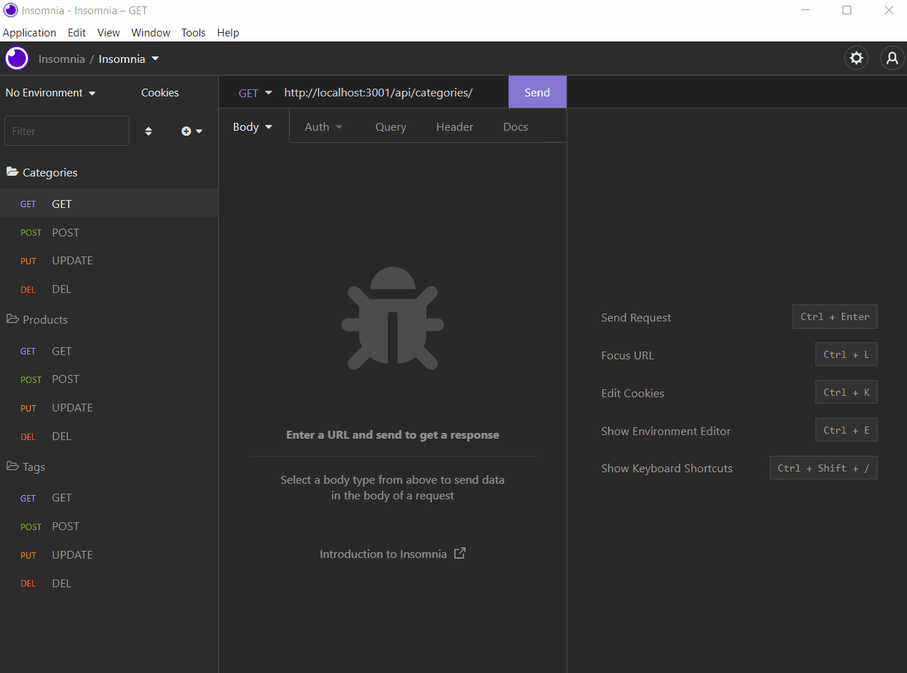

# 13 ORM-E-Commerce-Back-End

  
  


## Description

Internet retail, also known as **e-commerce**, is the largest sector of the electronics industry, generating an estimated $29 trillion in 2019. E-commerce platforms like Shopify and WooCommerce provide a suite of services to businesses of all sizes. Due to their prevalence, understanding the fundamental architecture of these platforms has become a necessary part of full-stack web developement.

This **e-commerce** application is developed using starter code to create a back-end application for an e-commerce site that uses the command line interface (CLI) and object-relational mapping for various methods of data manipulation, storage, and retrieval when using HTTP methods with a RESTUL API.

 It utlises Express.js API which uses Sequelize to interact with a MySQL database in order to build a back end for a shop's website.

## User Story

```md
AS A manager at an internet retail company
I WANT a back end for my e-commerce website that uses the latest technologies
SO THAT my company can compete with other e-commerce companies
```

## Acceptance Criteria

```md
GIVEN a functional Express.js API
WHEN I add my database name, MySQL username, and MySQL password to an environment variable file
THEN I am able to connect to a database using Sequelize
WHEN I enter schema and seed commands
THEN a development database is created and is seeded with test data
WHEN I enter the command to invoke the application
THEN my server is started and the Sequelize models are synced to the MySQL database
WHEN I open API GET routes in Insomnia for categories, products, or tags
THEN the data for each of these routes is displayed in a formatted JSON
WHEN I test API POST, PUT, and DELETE routes in Insomnia
THEN I am able to successfully create, update, and delete data in my database
```

## Walkthrough Video

## Mock-Up

The following animation shows the application's GET routes to return all categories, all products, and all tags being tested in Insomnia:


The following animation shows the application's GET routes to return a single category, a single product, and a single tag being tested in Insomnia:



The following animation shows the application's POST, PUT, and DELETE routes for categories being tested in Insomnia:


Your walkthrough video should also show the POST, PUT, and DELETE routes for products and tags being tested in Insomnia.

## Installation/Usage

```
npm i

npm run seed

npm start
```

---
© 2022 Umair Khalid. Confidential and Proprietary. All Rights Reserved.
